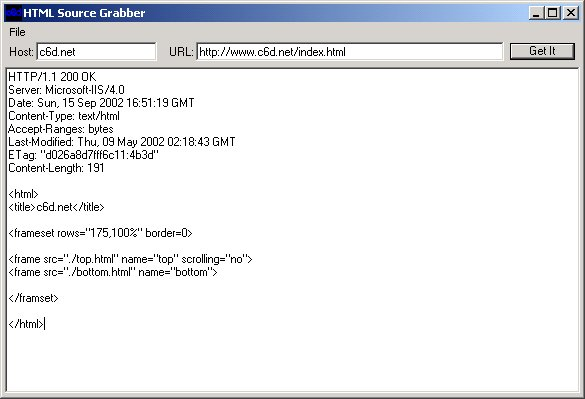



## HTML Source Grabber

### Description

This grabs the source to web pages. I made this because there were a few pages that did some things that I was curious on how it was done and I couldn't view the source with conventional methods because the page would not allow it or it forwarded me on too fast. Since this just opens up a socket to the web server and dumps the data to a text box it is unaffected by the actual code on the page.
 
### More Info
 

             |
---                |---
**Submitted On**   |2002-09-15 12:55:04
**By**             |[Dave Stringer](https://github.com/Planet-Source-Code/PSCIndex/blob/master/ByAuthor/dave-stringer.md)
**Level**          |Intermediate
**User Rating**    |4.0 (20 globes from 5 users)
**Compatibility**  |VB 6\.0
**Category**       |[Internet/ HTML](https://github.com/Planet-Source-Code/PSCIndex/blob/master/ByCategory/internet-html__1-34.md)
**World**          |[Visual Basic](https://github.com/Planet-Source-Code/PSCIndex/blob/master/ByWorld/visual-basic.md)
**Archive File**   |[HTML\_Sourc1314789152002\.zip](https://github.com/Planet-Source-Code/dave-stringer-html-source-grabber__1-39019/archive/master.zip)

